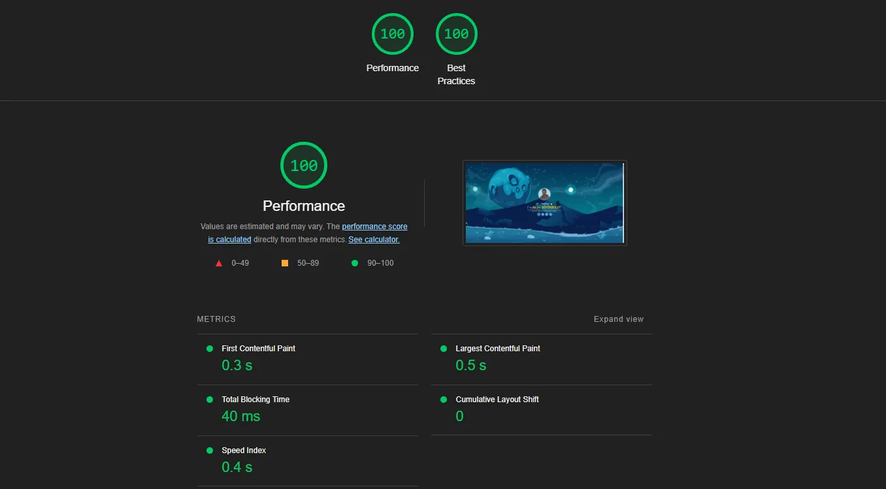

# Personal Portfolio

This repository contains the source code of my personal developer portfolio website at [aknbb.github.io](https://aknbb.github.io).

### Demo


### Technologies Used

* HTML5
* CSS3
* JavaScript (ES6)
* three.js 0.126.0
* Bootstrap 5.3.2
* Modernizr 2.6.2
* Pure WebGL
* Font Awesome 
* Webpack 5

### Getting Started

To run the application, follow these steps:

1. **Clone the personal-portfolio repository from GitHub:**

   ```
   https://github.com/Aknbb/personal-portfolio
    ```

2. **Install the dependencies:**

   1. Navigate to project directory.
   
        ```
        cd personal-portfolio
        ```   
      
   2. Install the dependencies.
   
        ```
        npm install
        ```
      
3. **Run / Build:**

    1. To start the application locally, execute the following command. The application will run on port 8080 and you can access it at http://localhost:8080
    
         ```
         npm run start
         ```
         
    2. To build the application, execute the following command. The **dist** folder will be created under the project directory. The contents of this folder can be transferred to the server that will serve it.
    
         ```
         npm run build
         ```

### Performance Score (Google Lighthouse)


    
### License

This project is licensed under the [MIT License](LICENSE).

#### Contact
Feel free to explore my Personal Portfolio project and get in touch if you have any questions or collaboration ideas. You can reach out to me via [akinbuyukbulut@gmail.com](mailto:akinbuyukbulut@gmail.com) or connect with me on [LinkedIn](https://www.linkedin.com/in/akinbuyukbulut/) and [GitHub](https://github.com/Aknbb).
